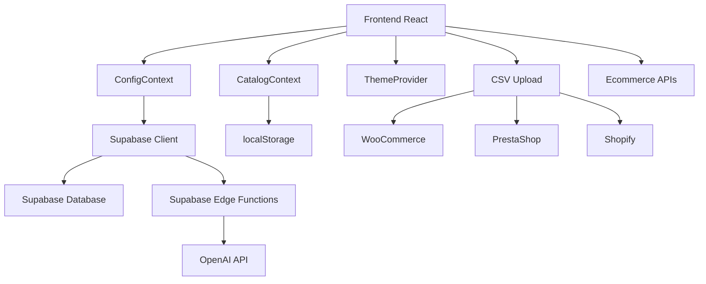

# 📚 Documentación del Proyecto - AI Chat Config Dashboard

## 📋 Índice
1. [Descripción General](#descripción-general)
2. [Arquitectura del Sistema](#arquitectura-del-sistema)
3. [Estructura de Archivos](#estructura-de-archivos)
4. [Configuración y Setup](#configuración-y-setup)
5. [Componentes Principales](#componentes-principales)
6. [Sistema de Configuración](#sistema-de-configuración)
7. [Gestión de Catálogo](#gestión-de-catálogo)
8. [Integración con AI](#integración-con-ai)
9. [Base de Datos](#base-de-datos)
10. [API y Endpoints](#api-y-endpoints)
11. [Deployment](#deployment)
12. [Guía de Desarrollo](#guía-de-desarrollo)

---

## 🎯 Descripción General

**AI Chat Config Dashboard** es una aplicación web que permite configurar y gestionar un sistema de chat con IA para múltiples clientes de ecommerce. El sistema está diseñado para:

- **Configurar prompts** personalizados por tono y cliente
- **Gestionar catálogos** desde múltiples fuentes (CSV, WooCommerce, PrestaShop, Shopify)
- **Probar conversaciones** con memoria contextual
- **Sincronizar automáticamente** con sistemas de ecommerce
- **Escalar** para múltiples clientes

### 🎨 Tecnologías Utilizadas
- **Frontend:** React 18 + TypeScript + Vite
- **UI:** Tailwind CSS + shadcn/ui
- **Estado:** React Context API
- **Base de Datos:** Supabase (PostgreSQL)
- **AI:** OpenAI GPT (vía Supabase Edge Functions)
- **Deployment:** Netlify

---

## 🏗️ Arquitectura del Sistema



### 🔄 Flujo de Datos
1. **Configuración:** Usuario configura prompts → Supabase → AI
2. **Catálogo:** CSV/Ecommerce → localStorage → AI prompts
3. **Chat:** Usuario escribe → Supabase Edge Function → OpenAI → Respuesta

---

## 📁 Estructura de Archivos

```
src/
├── components/           # Componentes reutilizables
│   ├── ui/              # Componentes UI base (shadcn/ui)
│   ├── CSVUploader.tsx  # Upload de archivos CSV
│   ├── EcommerceConnections.tsx # Conexiones ecommerce
│   ├── ProductStats.tsx  # Estadísticas de productos
│   └── EnhancedChatMessage.tsx # Mensajes de chat mejorados
├── lib/                 # Lógica de negocio
│   ├── config.ts        # Configuración por defecto
│   ├── configStorage.ts # Persistencia de configuración
│   ├── supabaseConfig.ts # Cliente Supabase
│   ├── supabaseChat.ts  # Comunicación con AI
│   ├── catalog.ts       # Gestión de catálogo
│   ├── productEnhancer.ts # Mejora de respuestas
│   ├── ConfigContext.tsx # Estado global configuración
│   └── CatalogContext.tsx # Estado global catálogo
├── pages/               # Páginas principales
│   ├── Dashboard.tsx    # Panel principal
│   ├── Configuration.tsx # Configuración de prompts
│   ├── Catalog.tsx      # Gestión de catálogo
│   ├── Testing.tsx      # Pruebas de chat
│   ├── Documentation.tsx # Documentación
│   └── Parameters.tsx   # Parámetros del modelo
├── utils/               # Utilidades
│   ├── theme-provider.tsx # Gestión de temas
│   └── supabase/       # Configuración Supabase
└── styles/             # Estilos globales
```

---

## ⚙️ Configuración y Setup

### 1. **Instalación de Dependencias**
```bash
npm install
```

### 2. **Variables de Entorno**
Crear `.env.local`:
```env
VITE_SUPABASE_URL=https://tu-proyecto.supabase.co
VITE_SUPABASE_ANON_KEY=tu-clave-publica
```

### 3. **Configuración Supabase**
- Crear proyecto en Supabase
- Ejecutar migraciones SQL (ver sección Base de Datos)
- Configurar Edge Functions

### 4. **Ejecutar en Desarrollo**
```bash
npm run dev
```

---

## 🧩 Componentes Principales

### **App.tsx**
Componente raíz que configura los providers:
```typescript
<ThemeProvider>
  <ConfigProvider>
    <CatalogProvider>
      <AppContent />
    </CatalogProvider>
  </ConfigProvider>
</ThemeProvider>
```

### **Sidebar**
Navegación principal con:
- Dashboard
- Configuration
- Catalog
- Testing
- Documentation
- Parameters

### **Páginas Principales**

#### **Dashboard.tsx**
- Resumen del sistema
- Estadísticas generales
- Accesos rápidos

#### **Configuration.tsx**
- Configuración de prompts por tono
- Parámetros del modelo AI
- URL del cliente
- Guardado en Supabase

#### **Catalog.tsx**
- Upload de CSV con drag & drop
- Conexiones a ecommerce
- Gestión manual de productos
- Estadísticas de sincronización

#### **Testing.tsx**
- Chat de prueba con memoria
- Mensajes mejorados con productos
- Contexto de conversación

---

## ⚙️ Sistema de Configuración

### **ConfigContext.tsx**
Maneja el estado global de configuración:

```typescript
interface ChatConfig {
  siteId: string;
  siteName: string;
  clientUrl: string;
  chatStatus: 'active' | 'testing' | 'inactive';
  tone: 'friendly' | 'premium' | 'technical' | 'casual' | 'professional';
  systemPrompts: {
    friendly: string;
    premium: string;
    technical: string;
    casual: string;
    professional: string;
  };
  model: 'gpt-3.5-turbo' | 'gpt-4' | 'gpt-4-turbo' | 'gpt-4o' | 'gpt-4o-mini';
  temperature: number;
  topP: number;
  maxTokens: number;
  language: 'es' | 'en' | 'pt' | 'fr' | 'de';
  versionTag: string;
}
```

### **Persistencia**
- **Supabase:** Configuración principal
- **localStorage:** Catálogo y archivos CSV
- **Sincronización:** Automática entre fuentes

---

## 📦 Gestión de Catálogo

### **CatalogContext.tsx**
Estado global del catálogo:

```typescript
interface Product {
  id: string;
  name: string;
  category: string;
  price: number;
  description: string;
  sku: string;
  imageUrl?: string;
  productUrl?: string;
  isActive: boolean;
  createdAt: string;
  updatedAt: string;
}
```

### **Fuentes de Datos**
1. **CSV Upload:** Drag & drop con validación
2. **WooCommerce:** API REST con Consumer Key/Secret
3. **PrestaShop:** Web Service con API Key
4. **Shopify:** API privada con credenciales
5. **Manual:** Interfaz de gestión directa

### **Sincronización**
- **Automática:** Al subir CSV o conectar ecommerce
- **Manual:** Botón de sincronización
- **Estado:** Visual en tiempo real

---

## 🤖 Integración con AI

### **supabaseChat.ts**
Comunicación con OpenAI vía Supabase Edge Functions:

```typescript
export const callSupabaseChat = async (
  message: string,
  systemPrompt?: string
): Promise<ChatResponse | ChatError>
```

### **Flujo de Chat**
1. **Cargar configuración** del usuario
2. **Generar prompt** basado en tono seleccionado
3. **Añadir catálogo** dinámico
4. **Enviar a OpenAI** vía Edge Function
5. **Procesar respuesta** y extraer productos
6. **Mostrar mensaje** mejorado

### **Mejora de Respuestas**
- **Extracción de productos** del texto AI
- **Tarjetas visuales** con imágenes y enlaces
- **Formato consistente** para productos

---

## 🗄️ Base de Datos

### **Tabla: chat_configurations**
```sql
CREATE TABLE chat_configurations (
  id UUID PRIMARY KEY DEFAULT gen_random_uuid(),
  site_id TEXT NOT NULL,
  site_name TEXT NOT NULL,
  client_url TEXT,
  chat_status TEXT NOT NULL DEFAULT 'testing',
  tone TEXT NOT NULL DEFAULT 'friendly',
  system_prompts JSONB,
  model TEXT NOT NULL DEFAULT 'gpt-4o-mini',
  temperature DECIMAL(3,2) NOT NULL DEFAULT 0.7,
  top_p DECIMAL(3,2) NOT NULL DEFAULT 1.0,
  max_tokens INTEGER NOT NULL DEFAULT 2048,
  language TEXT NOT NULL DEFAULT 'es',
  version_tag TEXT NOT NULL DEFAULT 'v1.0',
  created_at TIMESTAMP WITH TIME ZONE DEFAULT NOW(),
  updated_at TIMESTAMP WITH TIME ZONE DEFAULT NOW()
);
```

### **Migraciones**
Ejecutar en Supabase SQL Editor:
```sql
-- Ver archivo UPDATE_CHAT_CONFIGURATIONS_V2.sql
```

---

## 🔌 API y Endpoints

### **Supabase Edge Functions**

#### **openai-chat**
Endpoint para comunicación con OpenAI:
```typescript
// Request
{
  message: string;
  systemPrompt: string;
  model: string;
  temperature: number;
  topP: number;
  maxTokens: number;
  language: string;
  tone: string;
}

// Response
{
  success: boolean;
  response?: string;
  error?: string;
}
```

### **APIs Externas**
- **WooCommerce:** `/wp-json/wc/v3/products`
- **PrestaShop:** `/api/products`
- **Shopify:** `/admin/api/2023-10/products.json`

---

## 🚀 Deployment

### **Netlify**
1. **Conectar repositorio** GitHub
2. **Configurar build:**
   - Build command: `npm run build`
   - Publish directory: `dist`
3. **Variables de entorno:**
   - `VITE_SUPABASE_URL`
   - `VITE_SUPABASE_ANON_KEY`

### **Supabase**
1. **Edge Functions:**
   - Deploy función `openai-chat`
   - Configurar variables de entorno
2. **Database:**
   - Ejecutar migraciones
   - Configurar RLS (Row Level Security)

---

## 👨‍💻 Guía de Desarrollo

### **Agregar Nueva Funcionalidad**

#### 1. **Nuevo Componente**
```typescript
// src/components/NuevoComponente.tsx
import React from 'react';
import { Card, CardContent, CardHeader, CardTitle } from './ui/card';

export function NuevoComponente() {
  return (
    <Card>
      <CardHeader>
        <CardTitle>Nuevo Componente</CardTitle>
      </CardHeader>
      <CardContent>
        {/* Contenido */}
      </CardContent>
    </Card>
  );
}
```

#### 2. **Nueva Página**
```typescript
// src/pages/NuevaPagina.tsx
import { Card, CardContent, CardHeader, CardTitle } from "../components/ui/card";

export function NuevaPagina() {
  return (
    <div className="space-y-6">
      <div>
        <h1 className="tracking-tight mb-2">Nueva Página</h1>
        <p className="text-muted-foreground">Descripción</p>
      </div>
      {/* Contenido */}
    </div>
  );
}
```

#### 3. **Actualizar Navegación**
```typescript
// src/App.tsx
// Añadir nueva página al sidebar
```

### **Debugging**

#### **Console Logs**
```typescript
console.log('🔍 DEBUG:', variable);
console.error('❌ Error:', error);
console.log('✅ Success:', data);
```

#### **Herramientas de Desarrollo**
- **React DevTools:** Inspeccionar estado
- **Supabase Dashboard:** Ver datos
- **Network Tab:** Debug API calls

### **Testing**

#### **Probar Chat**
1. Ir a página Testing
2. Configurar prompts en Configuration
3. Probar diferentes tonos
4. Verificar memoria de conversación

#### **Probar Catálogo**
1. Subir CSV de prueba
2. Conectar ecommerce (modo test)
3. Verificar sincronización
4. Probar respuestas con productos

---

## 🔧 Troubleshooting

### **Problemas Comunes**

#### **Chat no responde**
- Verificar configuración Supabase
- Revisar Edge Function logs
- Comprobar API key OpenAI

#### **Configuración no se guarda**
- Verificar conexión Supabase
- Revisar permisos RLS
- Comprobar estructura de datos

#### **CSV no se procesa**
- Verificar formato (columnas requeridas)
- Revisar tamaño del archivo
- Comprobar encoding UTF-8

#### **Conexión ecommerce falla**
- Verificar credenciales API
- Comprobar URL de la tienda
- Revisar permisos de la API

### **Logs Útiles**
```typescript
// En supabaseChat.ts
console.log('🔍 DEBUG: Llamando a Supabase Edge Function...');
console.log('📝 Mensaje:', message);
console.log('🎯 System Prompt generado:', finalSystemPrompt);
```

---

## 📈 Roadmap y Mejoras Futuras

### **Funcionalidades Planificadas**
- [ ] **Más plataformas ecommerce** (Magento, BigCommerce)
- [ ] **Sincronización programada** (cron jobs)
- [ ] **Analytics avanzados** de conversaciones
- [ ] **Templates de prompts** predefinidos
- [ ] **Multi-idioma** completo
- [ ] **API pública** para integraciones

### **Optimizaciones**
- [ ] **Caching** de respuestas AI
- [ ] **Compresión** de imágenes
- [ ] **Lazy loading** de componentes
- [ ] **PWA** para móviles

---

## 📞 Soporte y Contacto

### **Documentación Adicional**
- [Supabase Docs](https://supabase.com/docs)
- [OpenAI API Docs](https://platform.openai.com/docs)
- [React Docs](https://react.dev)
- [Tailwind CSS](https://tailwindcss.com/docs)

### **Recursos del Proyecto**
- **Repositorio:** GitHub
- **Deployment:** Netlify
- **Base de Datos:** Supabase Dashboard
- **AI:** OpenAI Platform

---

## 📝 Changelog

### **v2.0.0** - Sistema Completo de Gestión
- ✅ Upload CSV con drag & drop
- ✅ Conexiones ecommerce (WooCommerce, PrestaShop, Shopify)
- ✅ Estadísticas en tiempo real
- ✅ Gestión manual de productos
- ✅ Sincronización automática

### **v1.0.0** - Versión Inicial
- ✅ Configuración de prompts
- ✅ Chat con memoria
- ✅ Integración OpenAI
- ✅ Persistencia Supabase

---

**¡Documentación completa! 🎉**

Esta documentación cubre todos los aspectos del proyecto para que cualquier desarrollador pueda entender, mantener y extender el sistema.
